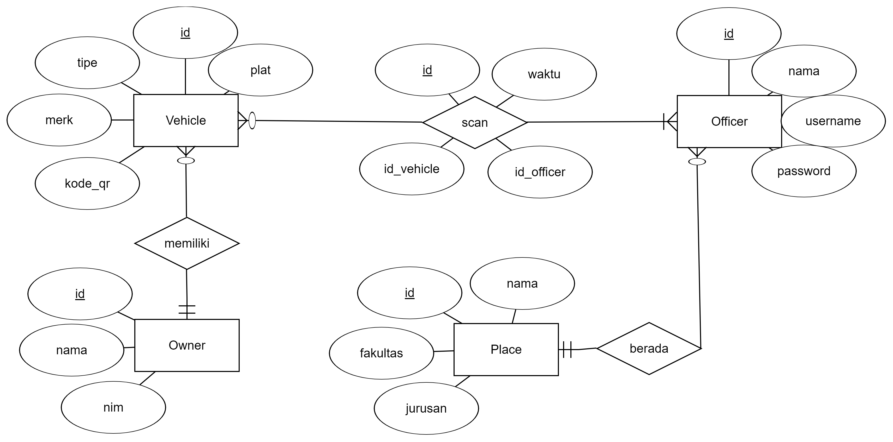

# Parkir RESTful PHP
RESTful web for QR Scan parking system built with PHP and ["Flight"](http://flightphp.com) micro-framework

## Entity Relationship Diagram


## QR Code Schema

I use some algorithm and pattern to accomplish a QR Code text

```
// String concat
QR = md5(plat + merk)
```

## Requests
### Login
**POST** `/api/login`

Endpoint to login

Post parameters

| Property | Type | Description |
| --- | --- | --- |
| username | String | Officer username | 
| password | String | Officer password |
| login | String | Whatever string |

Success response example
```json
{
  "status": 200,
  "message": "OK",
  "data": {
    "id": 2,
    "nama": "Parman",
    "username": "parman",
    "parkiran": "Parkiran GKB",
    "jurusan": "S1 Teknik Komputer",
    "fakultas": "Teknik"
  }
}
```

### Scan
**POST** `/api/scan`

Endpoint to scan a QR Code

Post parameters

| Property | Type | Description |
| --- | --- | --- |
| kode_qr | String | QR Code text |
| id_officer | Number | Officer ID |

Success response example
```json
{
  "status": 200,
  "message": "OK",
  "data": null
}
```

Response if QR Code doesn't exists
```json
{
  "status": 404,
  "message": "QR Code doesn't exists",
  "data": null
}
```

### Real Time
**GET** `/api/realtime`

Endpoint to get real time scan information

Success response example
```json
{
  "status": 200,
  "message": "OK",
  "data": [
    {
      "id": 1,
      "waktu": "2018-10-20 00:00:00",
      "merk": "Honda",
      "tipe": "Vario",
      "nama": "Fanny Hasbi"
    },
    {
      "id": 2,
      "waktu": "2018-11-20 19:46:38",
      "merk": "Honda",
      "tipe": "Vario",
      "nama": "Fanny Hasbi"
    }
  ]
}
```

### Data Parkir
**GET** `/api/data-parkir`

Endpoint to get monthly report of the officer's place scan results

Get parameters

| Property | Type | Description |
| --- | --- | --- |
| id_officer | Number | Officer ID |

Success response example
```json
{
  "status": 200,
  "message": "OK",
  "data": [
    {
      "waktu": "November 2018",
      "jumlah": 3
    },
    {
      "waktu": "Oktober 2018",
      "jumlah": 1
    }
  ]
}
```